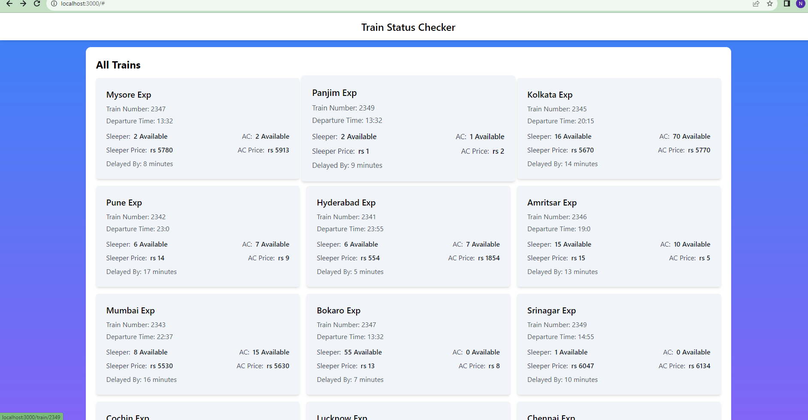

# Train Status Tracker

Train Status Tracker is a web application that allows users to track real-time information about train details and status. The application provides a user-friendly interface to view train schedules, availability, and delays.




##backend postman


## Table of Contents

- [Features](#features)
- [Demo](#demo)
- [Technologies Used](#technologies-used)
- [Getting Started](#getting-started)
  - [Prerequisites](#prerequisites)
  - [Installation](#installation)
- [Usage](#usage)
- [Real-time Updates](#real-time-updates)
- [Contributing](#contributing)
- [License](#license)

## Features

- View a list of all trains with their details.
- Check real-time availability and status updates.
- Refresh data to get the latest information.
- Responsive design for mobile and desktop devices.

## Demo

## Technologies Used

- Frontend: React.js, Next.js, Tailwind CSS.
- Backend: Node.js, Express.js.
- Real-time Updates: poling.
- API Requests: Axios.

## Getting Started

### Prerequisites

- Node.js (Install from [nodejs.org](https://nodejs.org))
- Git (Install from [git-scm.com](https://git-scm.com/))

### Installation

1. Clone the repository:

   ```bash
   git clone https://github.com/technitish9123/demo-fullstack.git
   ```

2. Navigate to the project directory:

   ```bash
   cd demo-fullstack
   ```

3. Install dependencies:

   ```bash
   npm install
   ```

4. Start the development server:

   ```bash
   npm run dev
   ```

5. Open your browser and navigate to [http://localhost:3000](http://localhost:3000).

## Usage

1. Upon launching the application, you'll see a list of all trains along with their details.

2. To view real-time updates, keep the application open. Any changes in train details will be automatically reflected.

3. You can manually refresh the data by clicking the "Refresh Data" button at the top of the page.

## Real-time Updates

The application utilizes poling to provide real-time updates.

## Contributing

Contributions are welcome! If you find a bug or have an enhancement in mind, feel free to open an issue or submit a pull request.

## License

This project is licensed under the [MIT License](./LICENSE).
